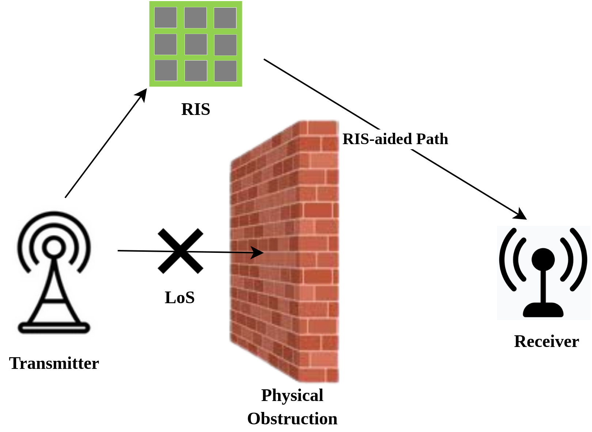
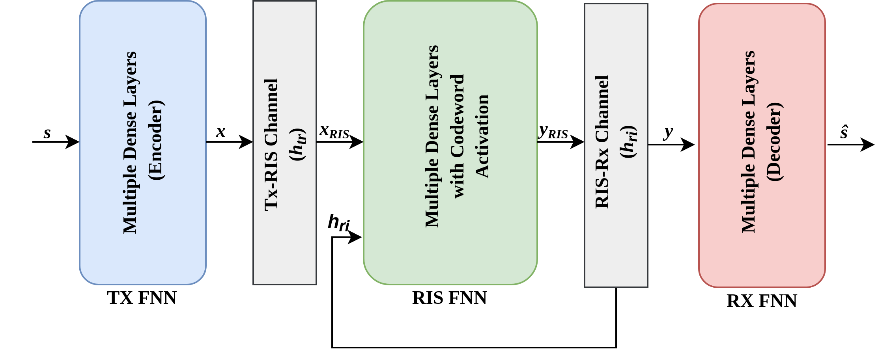

# Codebook Design and Autoencoder-based Codeword Selection for RIS-assisted Communications

Implementation of the <a href="https://www.techrxiv.org/articles/preprint/Codebook_Design_for_RIS-assisted_Communications/22776533)https://www.techrxiv.org/articles/preprint/Codebook_Design_for_RIS-assisted_Communications/22776533"> paper</a>

Reconfigurable Intelligence Surface (RIS) for wireless communication.

Autoencoder model for RIS.
